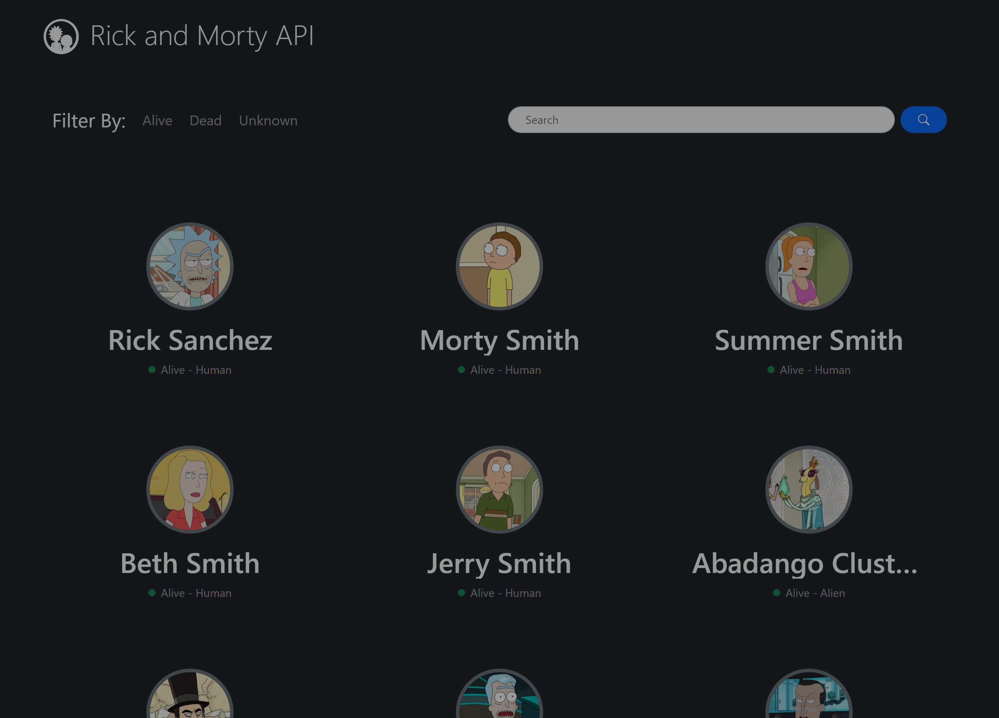
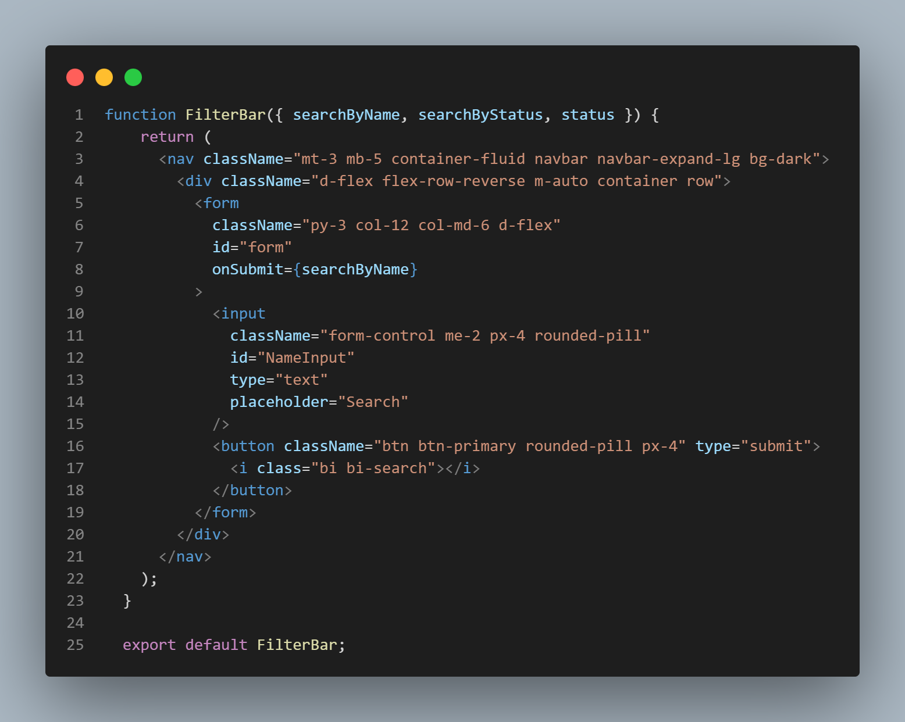

<!-- Badges -->
<section align="center">

  [![Contributors][contributors-shield]][contributors-url]
  [![Forks][forks-shield]][forks-url]
  [![Stargazers][stars-shield]][stars-url]
  [![Issues][issues-shield]][issues-url]

  [![LinkedIn][linkedin-shield]][linkedin-url]

</section>

 

<header align="center">
  
  <h1 align="center">Rick and Morty Search Engine</h1>
  
  
🔎 Search any character from the <a href="https://rickandmortyapi.com/">Rick and Morty</a> series 🔎

 
</header>

<section align="center">

  [Explore the docs](https://github.com/Cristian-Sosa/rick-and-morty-api)
  ·
  [View Demo](https://cristian-sosa.github.io/rick-and-morty-api/)
  ·
  [Report Bug](https://github.com/Cristian-Sosa/rick-and-morty-api/issues)
  ·
  [Request Feature](https://github.com/Cristian-Sosa/rick-and-morty-api/issues)
  
</section>

 

<!-- TABLE OF CONTENTS -->

  
<h3>Table of Contents</h3>

  <ul>
    <li>
      <a href="#about-the-project">About The Project</a>
      <ul>
        <li>Screenshots</li>
        <li>Built With</li>
        <li>Features</li>
      </ul>
    </li>
    <li><a href="#install">How to Install</a></li>
    <li><a href="#challenges">Challenges</a></li>
    <li><a href="#contact">Contact</a></li>
    <li><a href="#acknowledgments">Acknowledgments</a></li>
  </ul>

 
 
  
<section id="about-the-project">
  <h2>About the project</h2>

<article>

  <h3>📸 Screenshots</h3>

  

</article>
  
 
  
<article>
  
  <h3>👾 Built with</h3>
  
  - ReactJs 18.x
  - Bootstrap 5.x
  - Bootstrap Icons 1.10.x
  - Rick and Morty API
  
</article>
  
 

<article>
  
  <h3>🎯 Features</h3>
  
  - Version 1.1.0
    - enhancement: add function to search bar
    - enhancement: add function to filter bar
  - Version 1.0.1
    - enhancement: add visual effects to navegation
    - enhancement: add visual effect when the cards are loading
  - Version 1.0.0
    - bugfix: changes on the fetch api code
    - bugfix: remove the view more details button
    - enhancement: improved perfomance
  - Version 0.1.1
    - feature: create a top navbar to filter characters 
    - feature: create a footer navbar to navegate on pages
    - enhancement: add dinamic cards list
    - feature: create a button to view more details of a specific character
  - Version 0.1.0
    - feature: create a conection with rick and morty api
    - feature: create a static card component 
    - feature: create a static list of cards components
    - enhancement: add bootstrap styles 
    - enhancement: add dinamic data from the api fetch
  
</article>
</section>

 
 

<section id="install">
  <h2>💻 How to install?</h2>

<article>
  
  *For this project you will use NodeJs and NPM*

  <pre>
  <code>
   $ git clone https://github.com/Cristian-Sosa/rick-and-morty-api.git // Clone the repo
   
   $ cd rick-and-morty-api
   
   $ npm install // Install the dependencies
  </code>
  </pre>
  
  
  In the 'src' are all the files you may want to see
  
  
  <pre>
  
   + src
     + components
     + pages
     - App.jsx
     - main.jsx
  
  </pre>
  
  If you want locally run the server. You may use
  
  <pre>
  <code>
    $ npm run dev
  </code>
  </pre>
  
  If you want to see a locally deploy preview. You may use
  
  <pre>
  <code>
    $ npm run build
    $ npm run preview
  </code>
  </pre>
  
  Enjoy the project!
  
</article>
  
</section>

 
 

<section id="challenges">
  <h2>✨ A challenges snap peek</h2>

<article>

  <h3>🔎 Search by name function</h3>
  
  
This is a snap of the code. We will focus in a search by name function.

  
The component have a simple form with an input and a submit button, when we send the form one event captures the input value and a useState function is used to assign it to the name variable. As soon as this variable is re-asigned, an useEffect function make a fetch to the API and re-load the page with the new characters

  
  
  
The hooks were a challenge for me, I never used before and were a new concept to learn. However, I liked to learn it and it's something that I always going to use

  
  
  
  
The hooks were a challenge for me, I never used before and were a new concept to learn. However, I liked to learn it and it's something that I always going to use

</article>
  
</section>

 
 

<section id="contact">
  <h2>🤝🏽 Contact</h2>

<article>
  
  I'm Cristian Sosa - [instagram](https://www.instagram.com/crisg.sosa/) - gustavosocris@gmail.com
  
  Project Link: [https://github.com/Cristian-Sosa/rick-and-morty-api](https://github.com/Cristian-Sosa/rick-and-morty-api)

</article>
  
</section>

 
 

<section id="acknowledgments">
  <h2>💎 Acknowledgments</h2>
  
  I could haven't do this without help of:
  
  - [React docs](https://reactjs.org/docs/getting-started.html)
  - [MDN](https://developer.mozilla.org/en-US/)
  - [w3schools](https://www.w3schools.com/)
  - [Rick and Morty API](https://rickandmortyapi.com/)
  - You 🙌🏽 thanks for see the project
  
</section>

  
<!-- MARKDOWN LINKS & IMAGES -->
<!-- https://www.markdownguide.org/basic-syntax/#reference-style-links -->
[contributors-shield]: https://img.shields.io/github/contributors/Cristian-Sosa/rick-and-morty-api.svg?style=for-the-badge
[contributors-url]: https://github.com/Cristian-Sosa/rick-and-morty-api/graphs/contributors
  
[forks-shield]: https://img.shields.io/github/forks/Cristian-Sosa/rick-and-morty-api.svg?style=for-the-badge
[forks-url]: https://github.com/Cristian-Sosa/rick-and-morty-api/network/members

[stars-shield]: https://img.shields.io/github/stars/Cristian-Sosa/rick-and-morty-api.svg?style=for-the-badge
[stars-url]: https://github.com/Cristian-Sosa/rick-and-morty-api/stargazers

[issues-shield]: https://img.shields.io/github/issues/Cristian-Sosa/rick-and-morty-api.svg?style=for-the-badge
[issues-url]: https://github.com/Cristian-Sosa/rick-and-morty-api/issues

[linkedin-shield]: https://img.shields.io/badge/-LinkedIn-black.svg?style=for-the-badge&logo=linkedin&colorB=555
[linkedin-url]: https://linkedin.com/in/Cristian-Sosa-Gustavo
